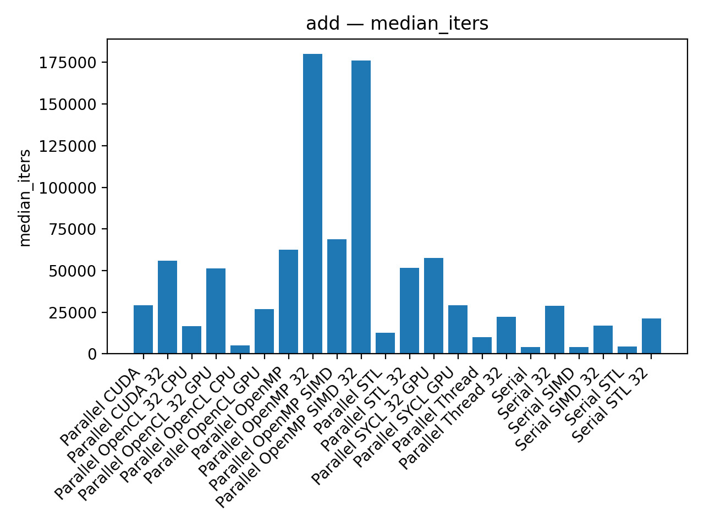
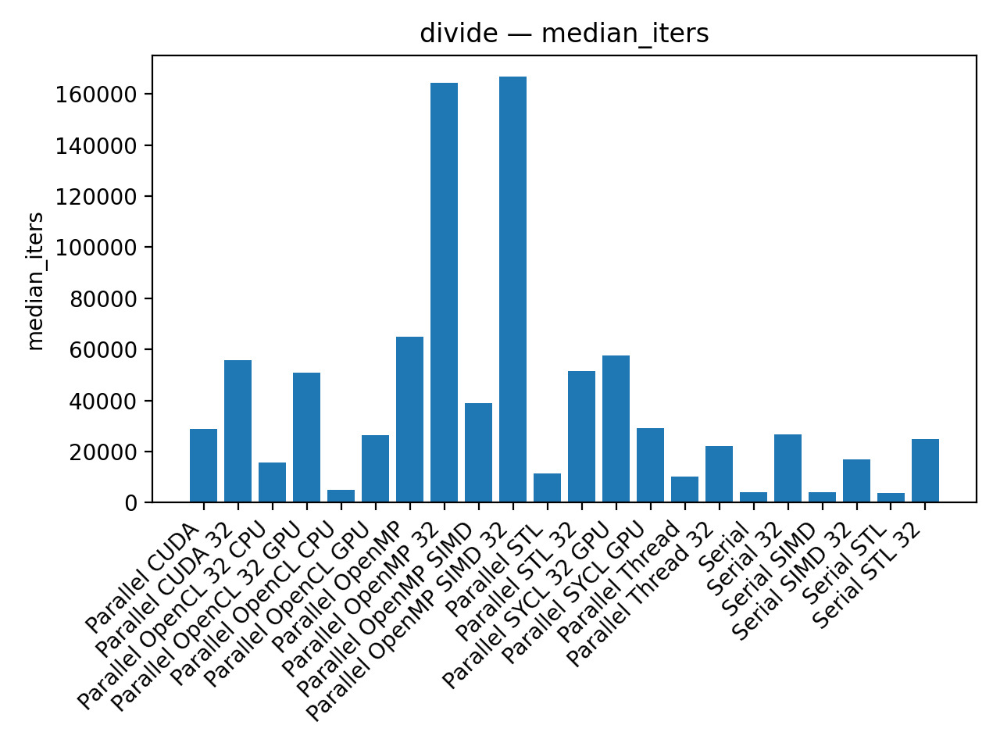
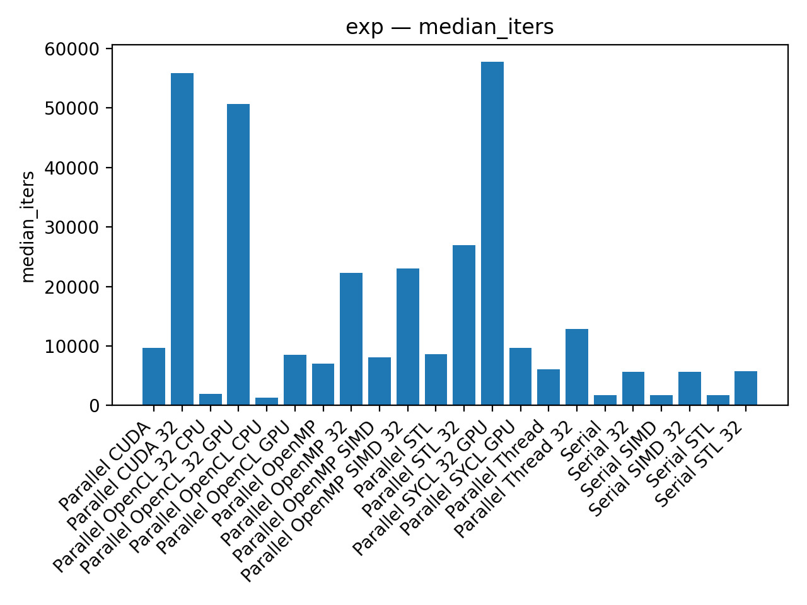
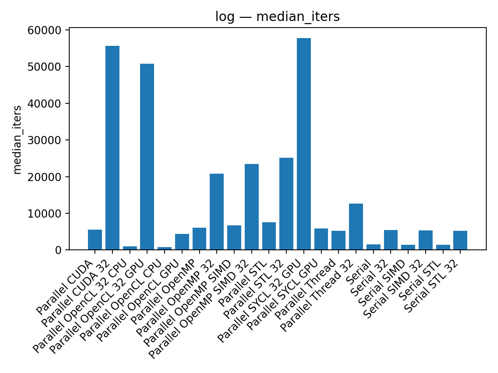
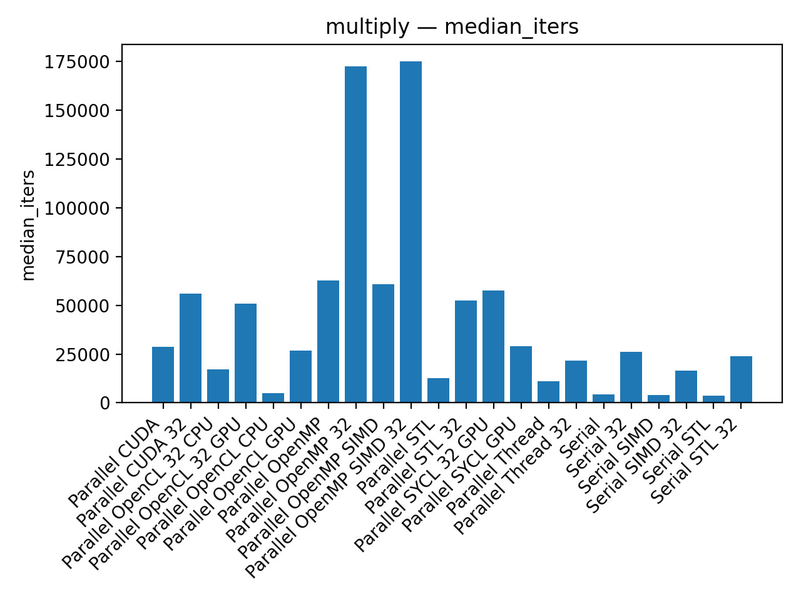
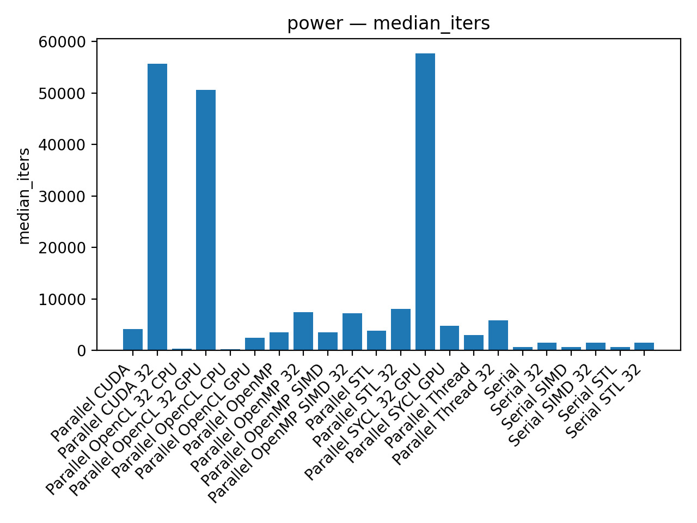
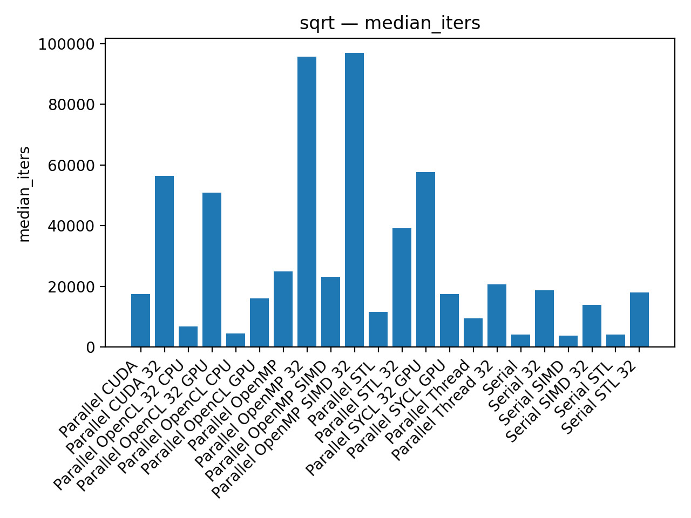

# Recommendations for the Adoption of GPU Computing by Small Research Teams in the Scientific Community

Repository of computer codes.

Trial codes:

- basic operations (add, multiply, sqrt, power, log, exp)
- sum vector
- dgemm
- stopping power

Evaluation codes:

- 2D heat equation
- 3D toy molecular dynamics 

Preliminary Results

