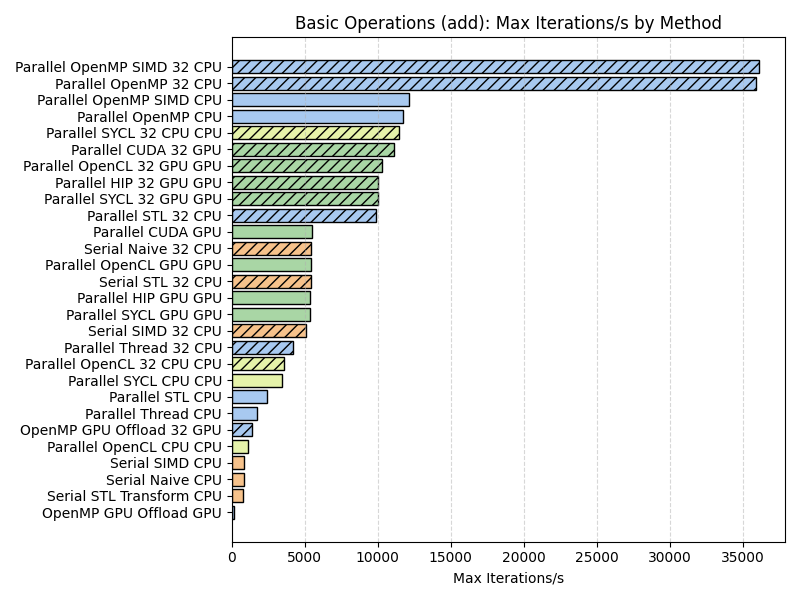
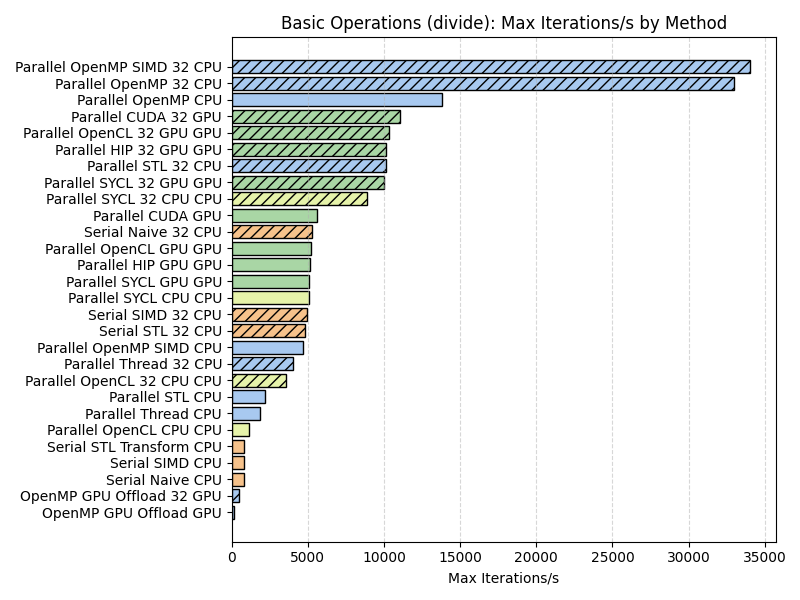
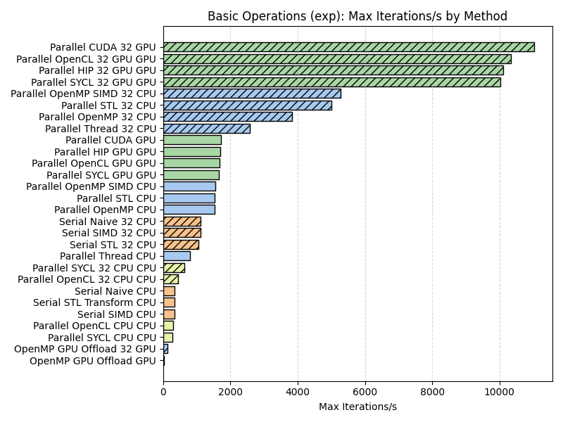
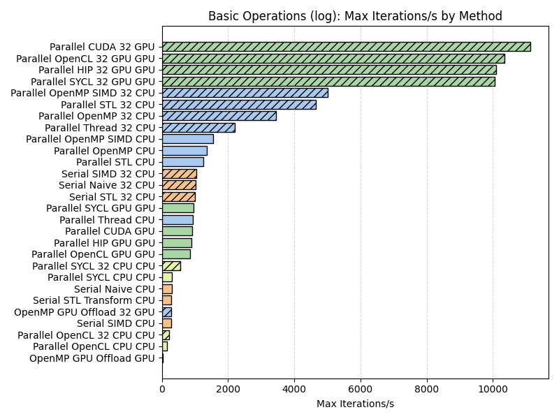
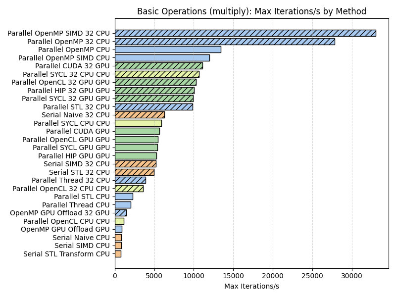
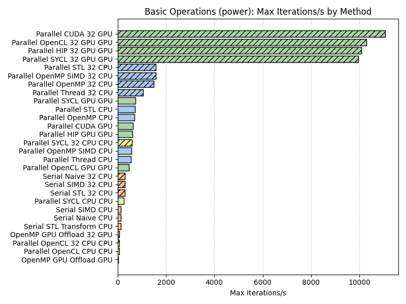
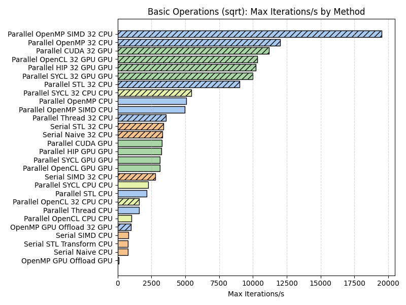
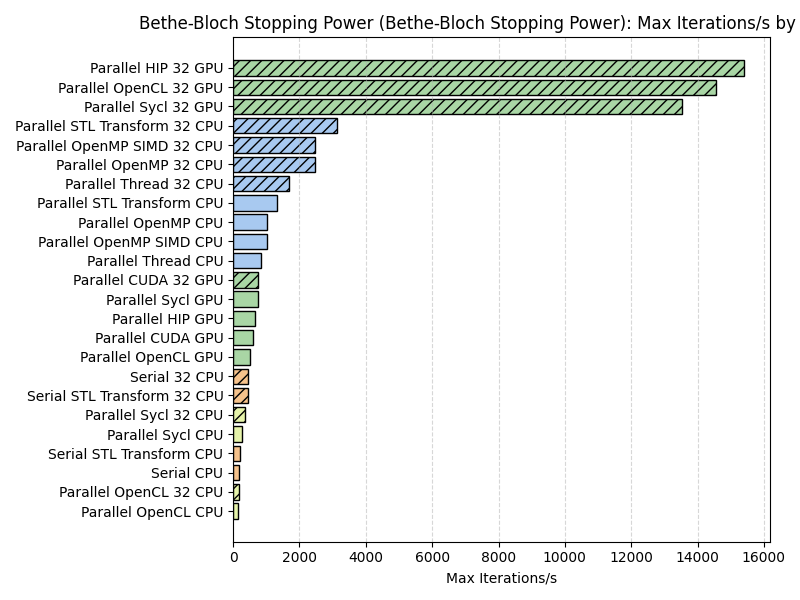
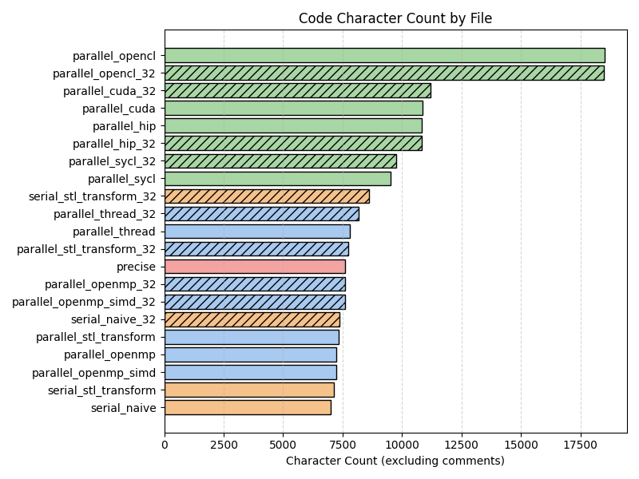

# Recommendations for the Adoption of GPU Computing by Small Research Teams in the Scientific Community

Repository of computer codes.

Trial codes:

- basic operations (add, multiply, sqrt, power, log, exp)
- sum vector
- dgemm
- stopping power

Evaluation codes:

- 2D heat equation
- 3D toy molecular dynamics 

## Trial 001 - Basic Operations

## Trial 002 - Reduction

## Trial 003 - Matrix Multiplication

## Trial 004 - Bethe-Bloch Stopping Power

## Heat2D

